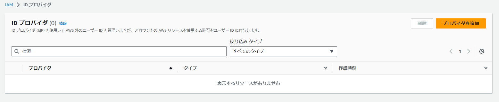
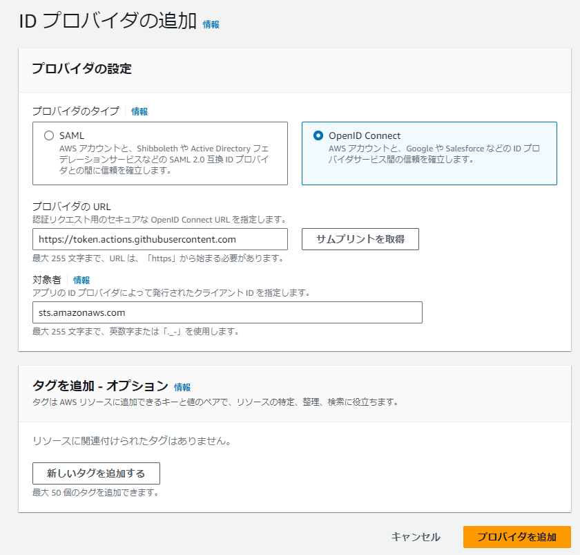
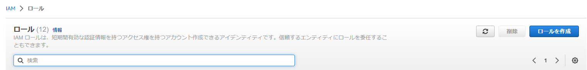

## 概要

github actionsでAWSにCI/CDを組む際に
IAMユーザーに紐づくアクセスキーで認証する事も出来るが漏洩したら大変な目に遭ってしまう。

なのでベストプラクティスとしてより安全性の高い OpenID Connect(OIDC)を使用する。

## 前提

- このリポジトリで検証します
- AWSアカウントが必要

## 設定方法

### プロバイダの追加
1. AWSのマネコンから IAM → プロバイダID に移動し「プロバイダの追加」


2. 以下の設定を実施し「プロバイダの追加」

- プロバイダのタイプ: OpenID Connect
- プロバイダの URL: https://token.actions.githubusercontent.com
↑サムプリントの取得を実施
- 対象者: sts.amazonaws.com



### ロールの追加

1. マネコンからロールを押下し「ロールの追加」



2. 「カスタム信頼ポリシー」を選択し、以下のJSONを入力

```text
{
  "Version": "2012-10-17",
  "Statement": [
    {
      "Effect": "Allow",
      "Principal": {
        "Federated": "<作成したIDプロバイダのARN>"
      },
      "Action": "sts:AssumeRoleWithWebIdentity",
      "Condition": {
        "StringEquals": {
          "token.actions.githubusercontent.com:aud": "sts.amazonaws.com",
          "token.actions.githubusercontent.com:sub": "repo:<GitHubの組織またはアカウント名>/<GitHubのリポジトリ名>:ref:refs/heads/main"
        }
      }
    }
  ]
}
```

3. 必要なポリシーをアタッチして、ロールの作成

### github actionsの設定

1. 以下のサンプルを参考に設定

```text
# Sample workflow to access AWS resources when workflow is tied to branch
# The workflow Creates static website using aws s3
name: AWS example workflow
on:
  push
env:
  BUCKET_NAME : "<example-bucket-name>"
  AWS_REGION : "<example-aws-region>"
# permission can be added at job level or workflow level
permissions:
      id-token: write   # This is required for requesting the JWT
      contents: read    # This is required for actions/checkout
jobs:
  S3PackageUpload:
    runs-on: ubuntu-latest
    steps:
      - name: Git clone the repository
        uses: actions/checkout@v3
      - name: configure aws credentials
        uses: aws-actions/configure-aws-credentials@v2
        with:
          role-to-assume: arn:aws:iam::1234567890:role/example-role
          role-session-name: samplerolesession
          aws-region: ${{ env.AWS_REGION }}
      # Upload a file to AWS s3
      - name:  Copy index.html to s3
        run: |
          aws s3 cp ./index.html s3://${{ env.BUCKET_NAME }}/
```

## 参考
https://docs.github.com/ja/actions/deployment/security-hardening-your-deployments/configuring-openid-connect-in-amazon-web-services