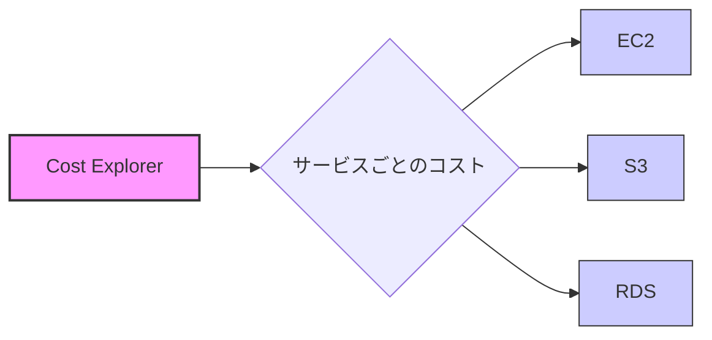
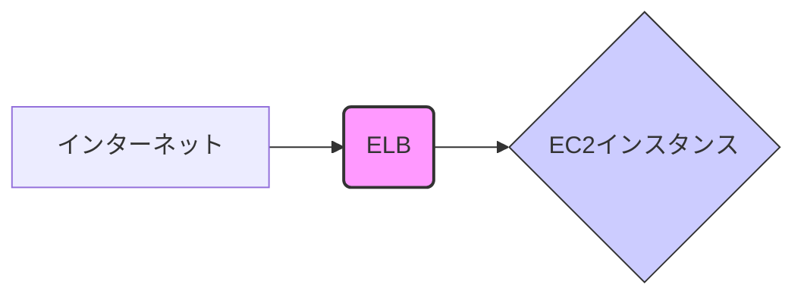
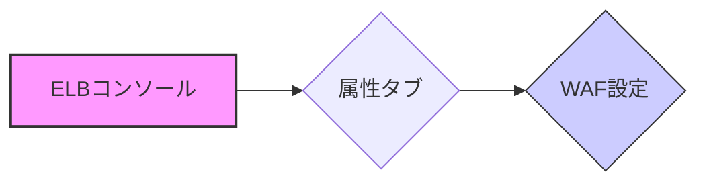
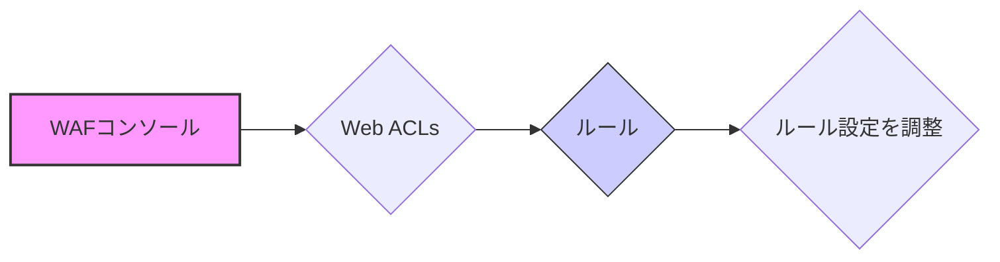

## 突然のSOS

ある日突然、「**AWS上で動いているシステムで原因不明のエラーが出ているんだけど、AWS詳しいからちょっと見てくれない？**」と、なんともざっくりとした依頼が舞い込んできました。
聞けば、2025/2/6 14:32頃に対象のwebアプリにブラウザからアクセスしたところエラーメッセージは「**403 Forbidden エラー**」。アクセスが拒否されていることを示すHTTPステータスコードですが、**なぜ403エラーが発生しているのか、原因は全く不明**とのこと。
今回対応するシステムは構築にも運用にも携わっておらず**システム構成図もドキュメントも一切なし**。手探り状態からの調査でした。
AWSにおいて情報がない状態からの障害対応について参考になれば幸いです。

## まずは現状把握から
闇雲に調査を始めても迷宮入りは必至。まずは **現状把握** から着実に進めます。

**1. Cost Explorer で利用サービスを特定**
手始めに、渡されたアクセスキーで AWS マネジメントコンソールにログインし、**Cost Explorer** を確認しました。

<details><summary>Cost Explorer 画面イメージ (クリックで展開)</summary>

</details>

Cost Explorer を確認したところ、**EC2 の課金額が高い** ことが分かりました。これで、エラーが出ているシステムが **EC2 上で提供されている** 可能性が高いと推測できました。

**2. EC2 インスタンスにログインして調査開始**
次に、Webとアプリが同居しているEC2 インスタンスを特定したのでログインし、エラーの詳細を調べることにしました。

**3. nginx のログを確認**
**nginx**のエラーログを確認します。

```bash
# nginx のエラーログを確認
cat /var/log/nginx/error.log
```

nginx のエラーログを確認しましたが、403 エラーを示唆するような **エラーログは記録されていません** でした。

**4. nginx アクセスログを確認 (2025/2/6 14:32頃のログを調査)**
エラーログに見当たらなくても 特定の日時 (2025/2/6 14:32頃) の nginx アクセスログを確認してみます。

```bash
# nginx のアクセスログを確認 (特定日時に絞り込み)
grep '06/Feb/2025:14:32' /var/log/nginx/access.log
```

nginx のアクセスログにも特段エラーに繋がる情報がありませんでした。

<details><summary>nginx アクセスログ (クリックで展開)</summary>

```
10.1.1.210 - - [06/Feb/2025:14:32:39 +0900] "GET /api/ping HTTP/1.1" 200 71 "-" "Mozilla/5.0 ..."
```
</details>

**5. syslog で Gunicorn のログを確認**
詳細なエラー情報を得るため、システムログ (`/var/log/syslog`) を確認しました。

```bash
# syslog を確認
cat /var/log/syslog | grep gunicorn
```

syslog を確認すると、Webアプリケーションサーバーである **Gunicorn** のログが出力されていることを確認。アプリケーションが Python 製である可能性が高まりました。しかし、syslog にも 403 エラーに関する情報は **見当たりません** でした。

<details><summary>syslog の Gunicorn ログ例 (クリックで展開)</summary>

```
Feb  6 05:32:45 [ホスト名] gunicorn[2156944]: INFO  2025-02-06 14:32:45,136 [app] Request: GET http://[example-domain.com]:443/[アプリケーション固有のエンドポイント]
Feb  6 05:32:45 [ホスト名] gunicorn[2156944]: INFO  2025-02-06 14:32:45,159 [app] Response: 400 http://[example-domain.com]:443/[アプリケーション固有のエンドポイント]
Feb  6 05:32:45 [ホスト名] gunicorn[2156944]: INFO  2025-02-06 14:32:45,539 [app] Request: GET http://[example-domain.com]:443/api/ping
Feb  6 05:32:45 [ホスト名] gunicorn[2156944]: INFO  2025-02-06 14:32:45,545 [app] Response: 200 http://[example-domain.com]:443/api/ping
```
</details>

**6. アプリケーションログ設定を確認**
Flask アプリケーションのログ設定を確認するため、`app.py` を探しました。

```bash
find / -type f | grep app.py
```

`/home/ubuntu/meter/apps/app.py`を発見しました。
また`/home/ubuntu/meter/apps/app.py` に `from flask import Flask`という記述があったのでFlaskである事が確定しました。

そして`/home/ubuntu/meter/apps/logging_config.py`から、アプリケーションログが `/home/ubuntu/meter/logs/` ディレクトリに出力されていることを確認しました。

<details><summary>/home/ubuntu/meter/apps/logging_config.py コード例 (クリックで展開)</summary>

```python
from logging import DEBUG, INFO, config
import datetime

today = datetime.date.today().strftime("%Y-%m-%d")

config.dictConfig({
    # ... (省略) ...
    "handlers": {
        # ... (省略) ...
        "fileHandler": {
            # ... (省略) ...
            "filename": f"logs/{{today}}.log",
            "level": INFO,
        },
    },
    # ... (省略) ...
    "loggers": {
        "basicLogger": {
            "handlers": ["streamHandler", "fileHandler"],
            "level": INFO,
            # ... (省略) ...
        }
    },
})
```
</details>

**7. アプリケーションログファイルを確認するも…やはりエラーは見当たらず**
`/var/log/nginx` 配下、`/var/log/syslog` に加え、`/home/ubuntu/meter/logs/` 配下のアプリケーションログも確認しましたが、**403 エラーに関するエラーログはやはり見当たりません** でした。

<details><summary>ログファイル確認コマンド例 (クリックで展開)</summary>

```bash
# nginx error log
cat /var/log/nginx/error.log*

# syslog
zgrep -E "(error|ERROR)" /var/log/syslog*

# アプリケーションログ (meter/logs)
grep -E "(error|ERROR)" /home/ubuntu/meter/logs/*
```
</details>

## 突破口は nginx のログと ELB の存在
再度 nginx アクセスログを確認すると、クライアントIPアドレスは **プライベートIPアドレス帯**。
そうなるとプライベートサブネット内にある**ELB (Elastic Load Balancer) などのロードバランサーを経由** している可能性が高い。

<details><summary>ELB構成図 (クリックで展開)</summary>

</details>

ここで冷静に考えると、もし Nginx が 403 エラーを返しているなら、Nginx エラーログにも何かしら記録が残るはずです。しかし、エラーログには何もなし。

**「…もしかして、403 エラーを返しているのは Nginx じゃない？ ELB が直接 403 を返しているのかも…？**」

という疑念が湧いてきました。

## ELB 設定と WAF を疑う
もし ELB が 403 エラーを返しているとしたら、原因として有力なのは

1. **ELB 自体の設定ミス:**  ELB のリスナー設定やセキュリティグループの設定ミスで、意図せずアクセスを拒否している (しかし、設定を確認した限り問題なさそう…)
2. **WAF (Web Application Firewall) によるブロック:**  ELB の前段に WAF が設定されており、WAF のルールによって不正アクセスと判断されブロックされている

そこで、ELB の設定画面を再度、今度は WAF に注目して確認してみると…

**WAF (AWS WAF - Web Application Firewall) が設定されている** ことを発見！

<details><summary>ELB コンソール WAF設定確認画面イメージ (クリックで展開)</summary>

</details>

WAF が原因である可能性が濃厚になってきました。

## WAF のログを確認 (ついに原因特定！)
WAF がリクエストをブロックしているかどうか確認するため、**WAF のログ** を確認します。
CloudWatch Logs を確認すると…

**WAF が 403 エラーの原因となっているログ** をついに発見！

<details><summary>CloudWatch Logs WAF ブロックログ例 (クリックで展開)</summary>
```
{
  "action": "BLOCK",
  "responseCode": 403,
  "ruleGroupList": [
    {
      "ruleGroupId": "ルールグループID",
      "terminatingRule": {
        "ruleId": "問題のルールID",
        "action": "BLOCK",
        "ruleMatchDetails": [...]
      }
    }
  ],
  "httpRequest": {
    "clientIp": "クライアントIPアドレス",
    "httpMethod": "GET",
    "httpUri": "/app/admin",
    "headers": [...]
  }
  ... (ログ詳細) ...
}
```
</details>

ログの内容から、WAF の特定のルールが `/app/admin` へのアクセスを不正と判断し、**ELBの手前で 403 Forbidden エラー** を返していたことが **判明** しました！

**原因特定と対策**
今回の403 Forbidden エラーの原因は、**AWS WAF (Web Application Firewall) のルール設定ミス** でした。
WAF のルール設定を見直し、**過剰に厳格になっていたルールを修正**。正常なアクセスを許可するように設定を変更しました。

<details><summary>WAF ルール設定画面イメージ (クリックで展開)</summary>

</details>

## 対策

- **WAF ルールの調整:**
WAF のルール設定を見直し、正常なアクセスを許可するようにルールを修正しました。具体的には、誤検知していたルールを特定し、条件を緩和したり、除外設定を追加したりしました。

- **依頼者への報告:**
WAF ルールを調整後、403 エラーが解消されたことを確認し、依頼者に復旧を報告しました。

## 教訓とまとめ
今回の403エラー調査を通して、改めて **ログを丁寧に確認することの重要性** を学びました。
特に、Nginx のアクセスログの **クライアントIPアドレス** から ELB の存在に気づき、そこから **WAF ログ** という「**真のエラーログ**」に辿り着けたのは、大きな収穫でした。
**ログは嘘をつかない**。今回のエラー解決は、まさにこの言葉を体現した経験となりました。

**教訓:**
- **AWS 環境ではログが命！:**  CloudWatch Logs、S3 アクセスログなど、AWS は様々なログ出力機能を提供しています。ログを効果的に活用すれば、複雑なシステムのエラーも解決に導けます。
- **ログの種類を意識する:**  Webサーバーログ、アプリケーションログ、WAFログなど、ログの種類によって出力される情報や確認すべきポイントが異なります。エラーの種類に合わせて適切なログを選択することが重要です。
- **固定観念にとらわれない:**  「nginx が 403 エラーを返している」という先入観にとらわれず、ELB や WAF など、関連するAWSサービスのログも幅広く確認することが、原因特定への近道となります。
